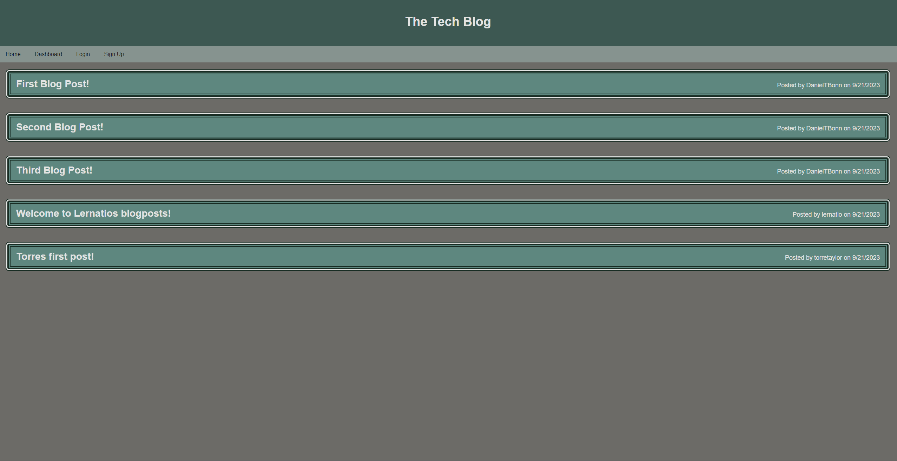

# MVC Tech Blog

## Description
  
As a developer who would like to post about new things i'm learning and likewise read what others are discovering themselves, I have created a tech blog that follows and MVC paradigm backed by a MYSQL database. I gained a better understanding of how the MVC paradigm works, learned how to use handlebars, and used session cookies for the first time.

- [Installation](#installation)
- [Usage](#usage)
- [Contribute](#contribute)
- [Tests](#tests)
- [Link](#links)
- [Questions](#questions)

## Installation
  
Clone this repo, install dependencies with npm i, make sure you're mysql server is running, and set .env variables to their proper values.

## Usage
  
At the command line, after having run npm i, run node server.js and direct yourself to `locahost:3001/`.

## Contribute
  
No contributions necessary, but any tips on how to improve my code are much appreciated.

## Tests
  
No tests written at this time.

## Links

https://gentle-retreat-99596-ab9698174a1f.herokuapp.com/

## Questions

Username: DanielTBonn
Github: https://github.com/DanielTBonn/
Email: danieltbonn@gmail.com